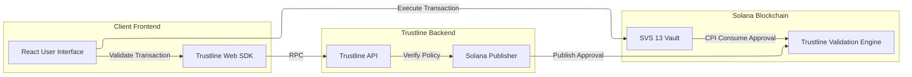

# Institutional Vault (Solana) + Trustline

**StableHacks 2026** — institutional-style tokenized vault on Solana, extended with **SVS-13** (adapter-aware, CPI-valued NAV) and a **Trustline** compliance and transaction-approval layer enforced on-chain.

**SVS-13** evolves the **SVS-2** stored-balance vault model from the [Solana Vault Standard](https://github.com/solanabr/solana-vault-standard) maintained by **SuperTeam Brasil** (`solanabr/solana-vault-standard`). This repo layers adapter NAV sync and Trustline enforcement on that baseline.

This monorepo combines:

- **On-chain vault** — ERC-4626–style flows (deposit, mint, withdraw, redeem) with stored-balance accounting, optional yield adapters, and role separation (authority, curator, allocator).
- **Trustline validation engine** — separate Anchor program that stores policy state and **consumes approvals** for specific instruction fingerprints (selector + data hash + protected accounts hash).
- **SVS-13 program integration** — when `trustline_enabled` is on, protected instructions require trailing accounts and a CPI into the validation engine so only Trustline-approved transactions succeed.
- **Demo web app** — React UI wired to devnet defaults, wallet adapters, and the Trustline Web SDK for pre-flight validation.

> **Note:** Defaults target **Solana devnet**. Program IDs in `Anchor/Anchor.toml` and `frontend/src/config.ts` match the hackathon/demo deployment story. This is **not** a production audit or deployment guide.

---

## Repository layout

| Path | Purpose |
|------|---------|
| [`Anchor/`](Anchor/) | Anchor workspace: **svs_13**, **trustline_validation_engine**, **svs_13_adapter_mock**, plus SVS-1–4 reference vaults, shared **modules/** (`svs-fees`, `svs-caps`, `svs-locks`, `svs-access`, etc.), TypeScript tests, and devnet init scripts. |
| [`Anchor/docs/specs-SVS13.md`](Anchor/docs/specs-SVS13.md) | SVS-13 design spec (adapter model, CPI `real_assets()`, roles, state). |
| [`frontend/`](frontend/) | Create React App: vault overview, role panels, Trustline-gated transaction building. |
| [`websdk/`](websdk/) | **`@trustline.id/websdk-solana`** — TypeScript SDK for `trustline.validate()` / Solana session flow against Trustline’s API. |

---

## Architecture (high level)



1. The **Client Frontend** builds a vault `TransactionInstruction`, optionally calls **Trustline** to obtain validation / an approval account address, and appends the **trailing accounts** (global config, protocol config, approval, engine program, instructions sysvar) expected by the **SVS 13 Vault**.
2. The **Trustline Backend** validates that the **user** and the **instruction** being executed **comply with the configured policy** for that protocol (rules defined off-chain and tied to the protected program / scope). Only after that check succeeds does the flow produce and publish the on-chain **approval** the vault will consume.
3. The **SVS 13 Vault** fingerprints the current instruction (via the instructions sysvar), then **CPIs** the validation engine’s `consume_approval` with that fingerprint. The engine verifies the approval matches the subject, scope, and hashes.
4. **Authority** can toggle **`set_trustline_config`** so the vault either behaves as a standard vault or enforces Trustline on the covered instructions.

Full Trustline account layout and hashing rules live in [`Anchor/programs/svs-13/src/trustline.rs`](Anchor/programs/svs-13/src/trustline.rs). Engine instructions and approval lifecycle are in [`Anchor/programs/trustline-validation-engine/src/lib.rs`](Anchor/programs/trustline-validation-engine/src/lib.rs).

---

## Prerequisites

- **Rust** (stable) and **Solana CLI** aligned with Anchor’s expectations
- **Anchor** `0.31.1` (see [`Anchor/Anchor.toml`](Anchor/Anchor.toml))
- **Node.js** + **npm** or **yarn** (Anchor tests use yarn in this repo)

---

## Build and test (programs)

From the `Anchor/` directory:

```bash
cd Anchor
anchor build
anchor test
```

`anchor test` runs the suite configured in `Anchor.toml` (including `tests/svs-*.ts` and `tests/modules.ts`). For module-specific features, the workspace notes may require `anchor build -- --features modules`.

---

## Devnet initialization (SVS-13 + Trustline + mock adapter)

The script [`Anchor/scripts/init-svs13-usdc-trustline-devnet.ts`](Anchor/scripts/init-svs13-usdc-trustline-devnet.ts) wires a USDC devnet mint, vault, Trustline global/protocol config, and related accounts using your local wallet (`ANCHOR_WALLET` / default Solana CLI keypair). Run it after `anchor build` so IDL artifacts under `target/` exist:

```bash
cd Anchor
npx ts-node scripts/init-svs13-usdc-trustline-devnet.ts
```

Adjust mint, names, or backend authority in the script if you are not using the demo parameters.

---

## Frontend

The app reads RPC URL, program id, vault address, and Trustline settings from environment variables (see [`frontend/src/config.ts`](frontend/src/config.ts)). Sensible devnet defaults are committed for a quick start.

**Trustline Web SDK dependency:** `frontend/package.json` references a packed tarball under `lib/websdk/`. If that path is not present, build and pack the local SDK, then place the `.tgz` there, or change the dependency to `file:../websdk` after running `npm run build` in `websdk/`:

```bash
cd websdk
npm install
npm run build
npm pack
mkdir -p ../lib/websdk && mv trustline.id-websdk-solana-*.tgz ../lib/websdk/

cd ../frontend
npm install
npm start
```

Set `REACT_APP_TRUSTLINE_CLIENT_ID` and related `REACT_APP_*` variables when using a real Trustline project (see [`websdk/README.md`](websdk/README.md)).

---

## Security and scope

- Adapter CPI return data and Trustline approvals are powerful primitives: **misconfigured adapters or policies can still lose funds or lock users out**. Treat this repo as a **hackathon / integration demo**, not a finished security review.
- The validation engine should be considered as **POC** policy surfaces. Read program sources before any real deployment.

---

## License

Some components keep their **existing upstream licenses**; those terms still apply to those paths:

| Location | License |
|----------|---------|
| [`Anchor/LICENSE`](Anchor/LICENSE) | MIT (Superteam Brazil) — Anchor workspace and vault programs/modules derived from [solana-vault-standard](https://github.com/solanabr/solana-vault-standard) |
| [`Anchor/sdk/core/LICENSE`](Anchor/sdk/core/LICENSE), [`Anchor/sdk/privacy/LICENSE`](Anchor/sdk/privacy/LICENSE) | Apache License 2.0 |
| [`websdk/LICENSE`](websdk/LICENSE) | MIT (Trustline) — Trustline Web SDK |

**Everything else** in this repository (including SVS-13 and Trustline validation engine programs, the demo frontend, root documentation, and any file not covered by the notices above) is licensed under the **MIT License**. The full text is in [`LICENSE`](LICENSE) at the repository root.

---

## Credits

Built for **StableHacks 2026**. **SVS-13** is specified in-repo ([`Anchor/docs/specs-SVS13.md`](Anchor/docs/specs-SVS13.md)) and is **based on SVS-2** from [**SuperTeam Brasil**’s Solana Vault Standard](https://github.com/solanabr/solana-vault-standard) — programs, modules, and patterns from that project underpin the stored-balance vault and shared `modules/` layout. **Trustline** provides the off-chain validation API and Web SDK; the Trustline validation engine and vault integration in this repository are hackathon/demo extensions.
